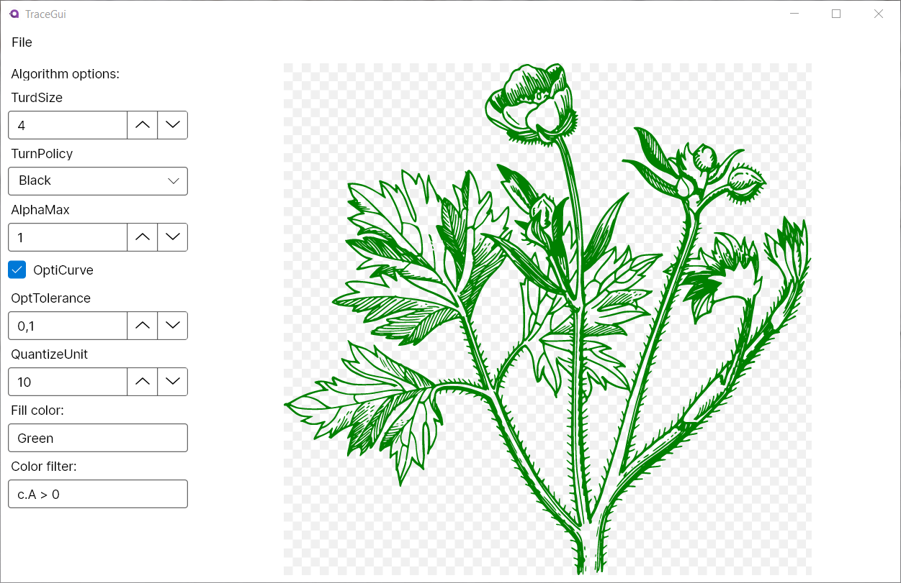

# Trace

[](https://dev.azure.com/wieslawsoltes/GitHub/_build/latest?definitionId=84)

[](https://github.com/wieslawsoltes/trace)
[](https://github.com/wieslawsoltes/trace)
[](https://github.com/wieslawsoltes/trace)

Trace is an application for transforming bitmaps into vector graphics using [BitmapToVector](https://github.com/daltonks/BitmapToVector) library.



* [BitmapToVector](https://github.com/daltonks/BitmapToVector) C# port of Potrace with optional SkiaSharp support.
* [Potrace](http://potrace.sourceforge.net/) Transforming bitmaps into vector graphics.
* [mkbitmap](http://potrace.sourceforge.net/mkbitmap.html) Transform images into bitmaps with scaling and filtering.
* [A detailed technical description of how the Potrace algorithm works.](http://potrace.sourceforge.net/potrace.pdf)
* [Technical documentation of the Potrace library API (for developers).](http://potrace.sourceforge.net/potracelib.pdf)
* [Avalonia - A cross platform XAML framework for .NET](http://avaloniaui.net/)

# Usage

### Turdsize

The turdsize parameter can be used to 'despeckle' the bitmap to be traced, by
removing all curves whose enclosed area is below the given threshold. The current default for the turdsize
parameter is 2. Its useful range is from 0 to infinity.

### Turnpolicy

The turnpolicy parameter determines how to resolve ambiguities during decomposition
of bitmaps into paths. 

The possible choices for the turnpolicy parameter are:
- Black: prefers to connect black (foreground) components.
- White: prefers to connect white (background) components
- Left: always take a left turn.
- Right: always take a right turn.
- Minority: prefers to connect the color (black or white) that occurs least frequently in a local neighborhood of the current position.
- Majority: prefers to connect the color (black or white) that occurs most frequently in a local neighborhood of the current position.
- Random: choose pseudo-randomly.

The current default policy is `Minority`, which tends to keep visual lines connected.

###  Alphamax

The alphamax parameter is a threshold for the detection of corners. It controls the
smoothness of the traced curve. The current default is 1.0. The
useful range of this parameter is from 0.0 (polygon) to 1.3334 (no corners).

### Opticurve and opttolerance

The opticurve parameter is a boolean flag that controls whether Potrace will attempt to `simplify` the final curve by reducing the number of Bezier curve segments.
Opticurve=1 turns on optimization, and opticurve=0 turns it off. The current default is on.

The opttolerance parameter defines the amount of error allowed in this simplification. The current default is 0.2. Larger values tend to decrease the number of
segments, at the expense of less accuracy. The useful range is from 0 to infinity, although in practice one would hardly choose values greater than 1 or so. For most
purposes, the default value is a good tradeoff between space and accuracy.

### Fill color

The fill color used for generated output path's. The default is hex value `#000000`. It also accepts named colors like `Red`, `Black` etc.

### Color filter

Color filter is an C# expression used to filter input bitmap colors. 
It has access to Rgba32 pixel sctruct represantion.

The default filter is `c.R < 128 && c.A > 0` where `c` is variable of type `Rgba32`.

Available `c` variable properties:
- `c.R` Red
- `c.G` Green
- `c.B` Blue
- `c.A` Alpha

# Building

Download and install [.NET 5.0 SDK](https://dotnet.microsoft.com/download).

### Build

```bash
dotnet build ./src/TraceGui/TraceGui.csproj -c Release
```

### Run

```bash
dotnet run --project ./src/TraceGui/TraceGui.csproj -c Release
```

### Publish

```bash
dotnet publish ./src/TraceGui/TraceGui.csproj -c Release -f net5.0 -r win7-x64 -o TraceGui-win7-x64
```

```bash
dotnet publish ./src/TraceGui/TraceGui.csproj -c Release -f net5.0 -r debian.8-x64 -o TraceGui-debian.8-x64
```

```bash
dotnet publish ./src/TraceGui/TraceGui.csproj -c Release -f net5.0 -r ubuntu.14.04-x64 -o TraceGui-ubuntu.14.04-x64
```

```bash
dotnet publish ./src/TraceGui/TraceGui.csproj -c Release -f net5.0 -r osx.10.12-x64 -o TraceGui-osx.10.12-x64
```

# Licensing

Trace is licensed under the [GPL-3.0 License](LICENSE).
